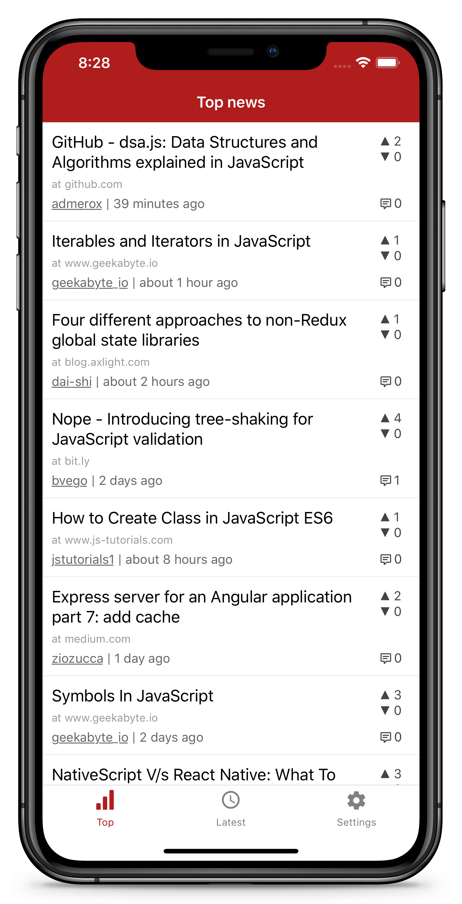

# EchoJS Reader

Open source [EchoJS](https://echojs.com/) reader built with React Native.

  
  

## Installation

Click badges above to install it from Apple App Store or Google Play.

Android users can also download APK file from [release page](https://github.com/pd4d10/echojs-reader/releases) and install it manually.

## Screenshots

## License

Apache-2.0
